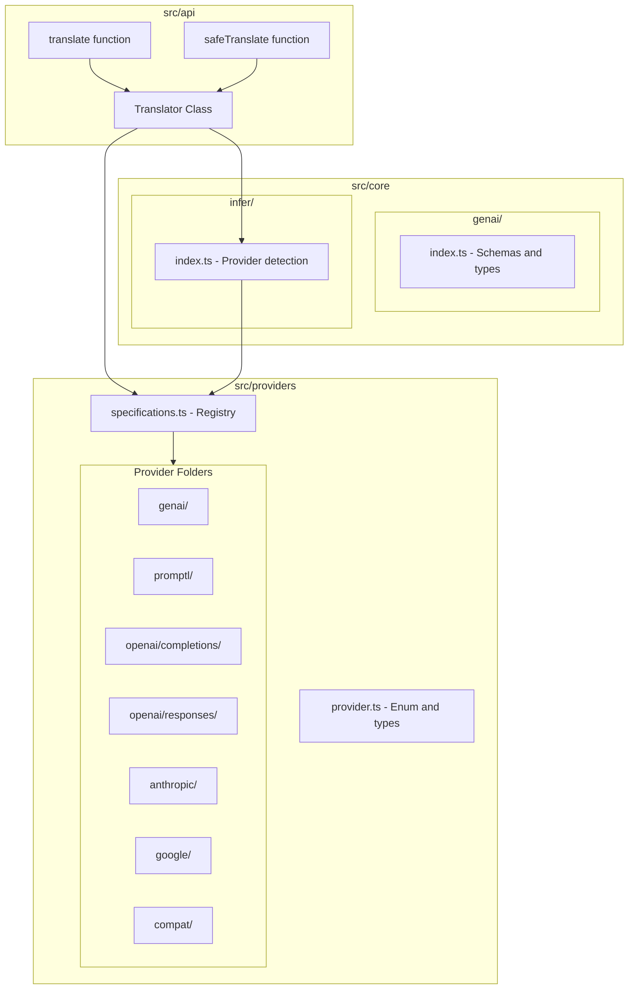

# Rosetta - AI Agent Instructions

This document provides context and guidelines for AI agents working on this codebase.

## Project Overview

**Rosetta** is a TypeScript library that translates messages between different LLM providers using a standardized intermediate format called **GenAI**.

### Supported Providers

- **GenAI** - Core format (intermediate and default)
- **Promptl** - Format used by the [promptl-ai](https://github.com/latitude-dev/promptl) package
- **VercelAI** - Vercel AI SDK message format (source and target)
- **OpenAI Completions** - OpenAI Chat Completions API format (source-only)
- **OpenAI Responses** - OpenAI Responses API format (source-only)
- **Anthropic** - Anthropic Messages API format (source-only)
- **Google** - Google Gemini GenerateContent API format (source-only)
- **Compat** - Universal fallback format for unknown providers (source-only)

More providers will be added incrementally.

### Architecture



### Translation Flow

```
┌─────────────┐     ┌─────────────┐     ┌─────────────┐
│  Provider A │     │  Provider B │     │  Provider C │
│   Format    │     │   Format    │     │   Format    │
└──────┬──────┘     └──────┬──────┘     └──────┬──────┘
       │                   │                   │
       ▼                   ▼                   ▼
┌──────────────────────────────────────────────────────┐
│              toGenAI() (always required)             │
└──────────────────────────┬───────────────────────────┘
                           ▼
                 ┌─────────────────┐
                 │  GenAI Schema   │
                 │  (Intermediate) │
                 └────────┬────────┘
                          ▼
┌──────────────────────────────────────────────────────┐
│            fromGenAI() (optional per provider)        │
└──────────────────────────┬───────────────────────────┘
       │                   │                   │
       ▼                   ▼                   ▼
┌─────────────┐     ┌─────────────┐     ┌─────────────┐
│  Provider A │     │  Provider B │     │  Provider C │
│   Format    │     │   Format    │     │   Format    │
└─────────────┘     └─────────────┘     └─────────────┘
```

## Directory Structure

```
src/
├── index.ts                    # Re-exports from ./api only
├── api/
│   ├── index.ts                # Public exports
│   └── translator.ts           # Translator class, types, and functions
├── core/
│   ├── index.ts                # Internal exports
│   ├── genai/
│   │   └── index.ts            # All Zod schemas and inferred types
│   ├── infer/
│   │   └── index.ts            # Provider inference logic
│   └── input/
│       └── index.ts            # Input types (InputMessages, InputSystem)
├── providers/
│   ├── index.ts                # Re-exports from provider.ts, metadata.ts, specifications.ts
│   ├── provider.ts             # Provider enum and types (separate to avoid circular deps)
│   ├── metadata.ts             # ProviderMetadataSchema (separate to avoid circular deps)
│   ├── specifications.ts       # PROVIDER_SPECIFICATIONS registry
│   ├── genai/                  # GenAI provider specification
│   ├── promptl/                # Promptl provider specification
│   ├── openai/
│   │   ├── completions/        # OpenAI Chat Completions provider
│   │   └── responses/          # OpenAI Responses API provider
│   ├── anthropic/              # Anthropic Messages API provider
│   ├── google/                 # Google Gemini API provider
│   ├── vercelai/               # Vercel AI SDK provider
│   └── compat/                 # Universal fallback provider (source-only)
└── utils/
    └── index.ts                # Shared utilities

examples/                       # E2E tests with real library integrations
├── genai.test.ts              # GenAI provider E2E tests
├── promptl.test.ts            # Promptl provider E2E tests (uses promptl-ai)
├── openai_completions.test.ts # OpenAI Completions E2E tests
├── openai_responses.test.ts   # OpenAI Responses E2E tests
├── anthropic.test.ts          # Anthropic E2E tests
├── google.test.ts             # Google Gemini E2E tests
├── vercelai.test.ts           # Vercel AI SDK E2E tests
├── vitest.config.ts           # Vitest config (imports from src directly)
└── package.json               # Separate package with vitest
```

## Public API

### Main Exports

```typescript
import { translate, safeTranslate, Translator, Provider } from "rosetta-ai";

// Quick usage - auto-infer source if not provided
const { messages, system } = translate(inputMessages);

// Specify source and target
const { messages, system } = translate(inputMessages, {
  from: Provider.Promptl,
  to: Provider.GenAI,
});

// Specify direction for output translation
const { messages } = translate(outputMessages, {
  from: Provider.GenAI,
  to: Provider.Promptl,
  direction: "output",
});

// Safe version (returns error instead of throwing)
const result = safeTranslate(messages);
if (result.error) {
  console.error("Translation failed:", result.error.message);
} else {
  console.log("Translated:", result.messages);
}

// Custom translator with inference priority
const translator = new Translator({
  inferPriority: [Provider.Promptl, Provider.GenAI],
});

// Custom translator that filters empty messages
const filteringTranslator = new Translator({
  filterEmptyMessages: true,
});
```

### Translator Configuration

The `Translator` class accepts configuration options:

```typescript
type TranslatorConfig = {
  // Priority order for provider inference (default: DEFAULT_INFER_PRIORITY)
  inferPriority?: Provider[];
  
  // Filter out empty messages during translation (default: false)
  // When true, removes messages with no parts or only empty text parts
  filterEmptyMessages?: boolean;
};
```

### Provider Enum

```typescript
enum Provider {
  GenAI = "genai",
  Promptl = "promptl",
  OpenAICompletions = "openai_completions",
  OpenAIResponses = "openai_responses",
  Anthropic = "anthropic",
  Google = "google",
  VercelAI = "vercel_ai",
  Compat = "compat",
}
```

New providers are added to this enum as they are implemented.

### Input Types

The input types allow flexible message input while each provider validates with its own Zod schema:

```typescript
import type { InputMessages, InputSystem } from "rosetta-ai";

// Messages can be a string or array of provider messages
type InputMessages = string | object[];

// System can be a string, single object, or array of parts
type InputSystem = string | object | object[];
```

### GenAI Schema

The GenAI schema is the intermediate format. Key entities:

- **GenAIMessage**: `{ role, parts, name?, finish_reason?, _provider_metadata? }`
- **GenAIPart**: Discriminated union by `type` field (text, blob, file, uri, reasoning, tool_call, tool_call_response, generic)
- **GenAISystem**: Array of GenAIParts

All entities include optional `_provider_metadata` for preserving provider-specific data during round-trips.

All GenAI schemas and types are prefixed with "GenAI" (e.g., `GenAIMessageSchema`, `GenAIMessage`, `GenAIPartSchema`, `GenAIPart`) to follow the same naming convention as other providers.

## Tech Stack

- **Language**: TypeScript (strict mode, ESM)
- **Schema Validation**: Zod v4
- **Linter/Formatter**: Biome (120 char line width, 2 spaces)
- **Testing**: Vitest
- **Bundler**: Rollup (ESM + CJS dual package)
- **Package Manager**: pnpm

## Development Guidelines

### File Organization Principles

**Keep modules consolidated - avoid unnecessary file splits:**

1. **Put schemas and types together**: Define Zod schemas and their inferred types in the same file, placing the type immediately after its schema definition.

2. **One index.ts per module**: Each module folder should have its main logic in `index.ts`. Don't create separate files like `types.ts`, `schemas.ts`, or `logic.ts` unless the file would exceed ~500 lines.

3. **Provider implementation in index.ts**: Each provider's specification, types, and registration should all live in the provider's `index.ts` file.

4. **Tests are the exception**: Test files (`.test.ts`, `.spec.ts`) should always be separate from the implementation.

5. **Extra files when necessary**: Although we prefer consolidated files, an extra file can be created when:
   - It's needed to fix circular dependencies (e.g., `metadata.ts` for shared schemas)
   - The concerns are genuinely separate (e.g., `translator.ts` for a distinct class)
   - The file would otherwise exceed ~500 lines
   - The provider has complex schemas that benefit from separation (e.g., `schema.ts` for message schemas)

**Example - Good (simple provider):**
```
providers/genai/
├── index.ts              # All logic, types, and registration
└── index.test.ts         # Tests only
```

**Example - Good (complex provider):**
```
providers/promptl/
├── index.ts              # Provider specification and conversion logic
├── index.test.ts         # Tests
├── metadata.ts           # Provider-specific metadata types
└── schema.ts             # Message and content schemas
```

**Example - Avoid:**
```
providers/genai/
├── index.ts
├── specification.ts      # Unnecessary split
├── types.ts              # Unnecessary split
└── index.test.ts
```

### Code Style

- Use Biome for formatting and linting
- Line width: 120 characters
- Use 2 spaces for indentation
- Prefer explicit types over inference for public APIs
- All schemas should be defined with Zod
- Use `// biome-ignore format:` comments to preserve intentional formatting (e.g., readable conditional types)
- **All imports and re-exports must be at the top of the file** - never put imports mid-code
- **Enum string values must be snake_case** - e.g., `GenAI = "genai"`
- **File names**: Prefer single word names when possible (e.g., `overview.ts`, `translator.ts`). If multiple words are needed, use snake_case (e.g., `tool_call.ts`)
- **Use `type` instead of `interface`** - always use `type Foo = { ... }` instead of `interface Foo { ... }`

### Import Alias

The project uses `$package` as an import alias that resolves to the `src/` directory. Use this instead of relative paths with `../`:

```typescript
// Preferred - use the alias
import { Provider } from "$package/providers";
import { GenAIMessage } from "$package/core/genai";

// Avoid - relative paths with multiple levels
import { Provider } from "../../providers";
```

The alias is configured in:
- **TypeScript**: `tsconfig.json` (`paths`)
- **Vitest**: `vitest.config.ts` (`resolve.alias`)
- **Rollup**: `rollup.config.ts` (`@rollup/plugin-alias`)

### Documentation

- Use JSDoc comments for public APIs
- **After completing a task, review if AGENTS.md or README.md need updates**:
  - **AGENTS.md** is for AI agents - contains architecture, directory structure, coding guidelines, and development instructions. Update when:
    - Adding/removing providers or major components
    - Changing directory structure or file organization
    - Updating coding conventions or patterns
    - Adding new development workflows or commands
  - **README.md** is for humans - contains API usage, installation, and supported features. Update when:
    - Adding/changing public API (new functions, options, types)
    - Adding/removing provider support
    - Changing installation or setup instructions
  - Be selective: not every code change needs documentation updates. Focus on changes that affect how the package is used (README) or developed (AGENTS)

### Comments

**NEVER use section separator comments with equals signs, dashes, or any decorative characters:**
```typescript
// BAD - DO NOT USE ANY OF THESE PATTERNS:
// =============================================================================
// Some Section
// =============================================================================

// =================================
// Another Section
// =================================

// -----------------------------------
// Yet Another Section
// -----------------------------------

// ***********************************
// Still Bad
// ***********************************
```

These are visual clutter and make the code harder to read. If you need to group related code, use:
- Simple JSDoc comments (`/** ... */`) for documentation
- Blank lines to separate logical groups
- Smaller, well-named files if groups become too large

**Always use `// TODO:` comments** for incomplete implementations or planned work:
```typescript
// TODO: Add support for streaming responses
// TODO: Handle edge case when parts array is empty
```

This makes it easy to track what's missing in the codebase by searching for `TODO`.

### Testing

- Place tests alongside source files: `*.test.ts` or `*.spec.ts`
- Use descriptive test names that explain the behavior
- Test both success and error cases
- Test edge cases for message format conversions

### Adding a New Provider

This is a comprehensive guide for adding a new provider to Rosetta.

**Important**: Always create the schema and metadata files FIRST, before registering the provider in the enum. Otherwise the linter will complain about missing types.

#### Schema Design Principles

When designing schemas for a new provider, follow these simplification principles:

1. **Only schematize entities with GenAI mappings**: Define explicit Zod schemas only for provider entities that map directly to GenAI parts (text, blob, uri, file, reasoning, tool_call, tool_call_response). This keeps schemas focused and maintainable.

2. **Only define fields used for translation**: Within each schema, only include fields that are actually used in the `toGenAI` conversion logic. All other fields (like `id`, `status`, `annotations`, `logprobs`, `filename`, etc.) will automatically flow through `.passthrough()` and be captured in `_provider_metadata` via `extractExtraFields`. This keeps schemas minimal and prevents them from breaking when the provider API adds new fields.

3. **Unify input/output schemas when possible**: If the provider has separate input and output types that map to the same GenAI entity, create a unified schema that accepts both. For example, instead of separate `InputTextPartSchema` and `OutputTextPartSchema`, create a single `TextPartSchema` with `type: z.enum(["input_text", "output_text"])`. This reduces code duplication and simplifies the conversion logic.

4. **Use passthrough for specialized features**: Other item types (built-in tools like web_search, file_search, computer_use, MCP, code_interpreter, etc.) don't need detailed schemas. Capture them with minimal type checking and convert to GenAI generic parts, preserving all data in `_provider_metadata`.

5. **Focus on complete messages only**: Don't schema streaming-related types (delta events, done events, in_progress events). Only schema complete message/item structures that represent the final state.

6. **Keep schemas simple**: A simpler schema is easier to maintain and less likely to break when the provider API adds new fields. Let `.passthrough()` handle unknown fields automatically.

**Example - OpenAI Responses provider:**
```typescript
// Unified text part schema (handles both input_text and output_text)
export const OpenAIResponsesTextPartSchema = z
  .object({
    type: z.enum(["input_text", "output_text"]),
    text: z.string(),
    // annotations, logprobs, etc. flow through .passthrough() to metadata
  })
  .passthrough();

// Only fields used for translation are defined:
// - message: type, role, content (not id, status)
// - function_call: type, call_id, name, arguments (not id, status)
// - reasoning: type, summary (not id, encrypted_content, status)

// Passthrough items (converted to generic parts):
// - file_search_call, web_search_call, computer_call, code_interpreter_call
// - mcp_call, mcp_list_tools, mcp_approval_request, mcp_approval_response
// - image_generation_call, local_shell_call, etc.
```

#### Step 1: Create Provider Schemas and Metadata

Create `src/providers/{provider_name}/` folder with:

- `schema.ts` - Message and content Zod schemas
- `metadata.ts` - Provider-specific metadata schema

**1.1. Create message schema** (`schema.ts`):

```typescript
import { z } from "zod";
import type { Infer } from "$package/utils";

export const NewProviderMessageSchema = z
  .object({
    role: z.enum(["user", "assistant", "system"]),
    content: z.string(), // or z.array(...) for structured content
    // Add provider-specific fields
  })
  .passthrough(); // Always use passthrough to preserve unknown fields

// Use Infer<T> for external SDK providers (OpenAI, Anthropic, etc.)
// This removes the index signature for compatibility with external SDK types
export type NewProviderMessage = Infer<typeof NewProviderMessageSchema>;

// For internal formats (GenAI, Promptl), use z.infer<T> instead:
// export type NewProviderMessage = z.infer<typeof NewProviderMessageSchema>;
```

**1.2. Create metadata schema** (`metadata.ts`):

```typescript
import { z } from "zod";

// For source-only providers, use opaque passthrough - no explicit fields needed
export const NewProviderMetadataSchema = z.object({}).passthrough();
export type NewProviderMetadata = z.infer<typeof NewProviderMetadataSchema>;

// For target providers (with fromGenAI), you MAY define explicit fields if needed:
// export const NewProviderMetadataSchema = z.object({
//   fieldNeededInFromGenAI: z.string().optional(),
// }).passthrough();
```

**Metadata Schema Guidelines:**

- **Prefer opaque passthrough**: Use `z.object({}).passthrough()` unless you have a specific reason to define fields explicitly
- **Only define fields you need to ACCESS programmatically** in your conversion logic (typically in `fromGenAI`)
- **Source-only providers don't need explicit fields**: Since they only convert TO GenAI, metadata is just preserved for potential downstream use
- **Treat metadata as opaque data**: Store any extra/unknown fields as-is and retrieve them as-is - don't over-engineer the schema

**1.3. Register metadata** (`src/providers/metadata.ts`):

```typescript
import { NewProviderMetadataSchema } from "$package/providers/new_provider/metadata";

export const ProviderMetadataSchema = z.object({
  genai: z.never().optional(),
  promptl: PromptlMetadataSchema.optional(),
  new_provider: NewProviderMetadataSchema.optional(), // Must match enum value
});
```

#### Step 2: Register the Provider

Now that the types exist, register the provider in the enum and type mappings.

**2.1. Add to Provider enum** (`src/providers/provider.ts`):

```typescript
export enum Provider {
  GenAI = "genai",
  Promptl = "promptl",
  OpenAICompletions = "openai_completions",
  NewProvider = "new_provider", // snake_case value
}
```

**2.2. Update type mappings** in the same file:

```typescript
// ProviderMessage<P> - Maps provider to its message type
export type ProviderMessage<P extends Provider> =
  P extends Provider.GenAI ? GenAIMessage :
  P extends Provider.NewProvider ? NewProviderMessage :
  never;

// ProviderSystem<P> - Maps provider to its system type
// Use `never` if this provider embeds system in messages (like Promptl)
export type ProviderSystem<P extends Provider> =
  P extends Provider.GenAI ? GenAISystem :
  P extends Provider.NewProvider ? never : // or NewProviderSystem if separated
  never;

// ProviderMetadata<P> - Maps provider to its metadata type
// Use `never` for GenAI (it's the intermediate, doesn't store its own metadata)
export type ProviderMetadata<P extends Provider> =
  P extends Provider.NewProvider ? NewProviderMetadata :
  never;
```

#### Step 3: Implement the Specification

Create `index.ts` in the provider folder:

```typescript
import type { GenAIMessage, GenAIPart } from "$package/core/genai";
import { NewProviderMessageSchema, type NewProviderMessage } from "./schema";
import {
  Provider,
  type ProviderFromGenAIArgs,
  type ProviderSpecification,
  type ProviderToGenAIArgs,
} from "$package/providers/provider";

export const NewProviderSpecification = {
  provider: Provider.NewProvider,
  name: "New Provider",
  messageSchema: NewProviderMessageSchema,
  // systemSchema: NewProviderSystemSchema, // Only if separated from messages

  toGenAI({ messages, direction }: ProviderToGenAIArgs) {
    // Handle string input - use direction to set role
    if (typeof messages === "string") {
      const role = direction === "input" ? "user" : "assistant";
      messages = [{ role, content: messages }];
    }

    // Validate with schema
    const parsedMessages = NewProviderMessageSchema.array().parse(messages);

    // Convert each message
    const converted: GenAIMessage[] = [];
    for (const message of parsedMessages) {
      converted.push(convertToGenAI(message));
    }
    return { messages: converted };
  },

  // Optional: Only implement if you want this provider to be a target
  fromGenAI({ messages, direction }: ProviderFromGenAIArgs) {
    const converted: NewProviderMessage[] = [];
    for (const message of messages) {
      converted.push(convertFromGenAI(message));
    }
    return { messages: converted };
  },
} as const satisfies ProviderSpecification<Provider.NewProvider>;
```

#### Step 4: Register the Specification

Add to `src/providers/specifications.ts`:

```typescript
import { NewProviderSpecification } from "$package/providers/new_provider";

const PROVIDER_SPECIFICATIONS = {
  [Provider.GenAI]: GenAISpecification,
  [Provider.NewProvider]: NewProviderSpecification,
} as const satisfies { [P in Provider]: ProviderSpecification<P> };
```

#### Step 5: Handle the `direction` Parameter

The `direction` parameter indicates whether messages are being prepared for model input or processed from model output:

- `"input"` - Messages going TO the model (user prompts, conversation history)
- `"output"` - Messages coming FROM the model (assistant responses)

**Use direction for string input:**

```typescript
toGenAI({ messages, direction }) {
  if (typeof messages === "string") {
    // Input: treat as user message, Output: treat as assistant response
    const role = direction === "input" ? "user" : "assistant";
    messages = [{ role, content: messages }];
  }
  // Validate and use parsedMessages for type-safe iteration
  const parsedMessages = MessageSchema.array().parse(messages);
  // ...
}
```

#### Step 6: Preserve Information with `_provider_metadata`

GenAI allows passthrough for roles, has a generic part type, and supports `_provider_metadata` on every entity. Use these to minimize information loss.

**6.1. The Known Fields Pattern:**

Use `extractExtraFields` with a list of "known" keys to automatically capture everything else as metadata:

```typescript
// Only list fields you EXPLICITLY handle in your conversion code
const KNOWN_MESSAGE_KEYS = ["role", "content", "name", "tool_calls"];

function convertToGenAI(message: NewProviderMessage): GenAIMessage {
  // Everything NOT in KNOWN_MESSAGE_KEYS automatically goes to extraFields
  const extraFields = extractExtraFields(message, KNOWN_MESSAGE_KEYS);

  return {
    role: message.role,
    parts: [{ type: "text", content: message.content }],
    ...(message.name ? { name: message.name } : {}),
    // Store all unknown fields as opaque metadata
    ...(Object.keys(extraFields).length > 0
      ? { _provider_metadata: { new_provider: extraFields } }
      : {}),
  };
}
```

**Key principle**: If you're NOT explicitly using a field in your conversion logic, DON'T put it in `knownKeys`. Let it flow automatically to metadata via `extractExtraFields`.

**Anti-pattern to avoid:**
```typescript
// BAD: Adding to known keys then manually re-adding
const knownKeys = ["role", "content", "annotations"]; // annotations in known list
const extraFields = extractExtraFields(message, knownKeys);
if (message.annotations) extraFields.annotations = message.annotations; // Why exclude then re-add?

// GOOD: Just don't include it in known keys
const knownKeys = ["role", "content"]; // annotations NOT in list
const extraFields = extractExtraFields(message, knownKeys); // annotations automatically included
```

**6.2. Restore fields when converting back (target providers only):**

```typescript
function convertFromGenAI(message: GenAIMessage): NewProviderMessage {
  const metadata = message._provider_metadata?.new_provider ?? {};

  return {
    role: mapRole(message.role),
    content: extractContent(message.parts),
    ...metadata, // Restore all preserved fields
  };
}
```

**6.3. Use GenAI's flexibility:**

- **Passthrough roles**: GenAI accepts `z.union([GenAIRoleSchema, z.string()])`, so custom roles like "developer" pass through
- **Generic parts**: For unsupported content types, use `{ type: "custom_type", content: "...", ...data }`
- **Modality strings**: GenAI accepts `z.union([GenAIModalitySchema, z.string()])` for custom modalities

#### Step 7: Handle System Instructions

Providers handle system instructions differently:

**Option A: System embedded in messages** (like Promptl):
- Set `ProviderSystem<P>` to `never`
- Don't define `systemSchema`
- System messages are regular messages with `role: "system"`

**Option B: System separated from messages** (like GenAI):
- Define a `systemSchema`
- Handle `system` parameter in `toGenAI`:

```typescript
toGenAI({ messages, system, direction }) {
  // Handle messages (string or array)
  if (typeof messages === "string") {
    const role = direction === "input" ? "user" : "assistant";
    messages = [{ role, parts: [{ type: "text", content: messages }] }];
  }
  const parsedMessages = MessageSchema.array().parse(messages);

  // Handle system (string, single object, or array)
  if (typeof system === "string") {
    system = [{ type: "text", content: system }];
  } else if (system !== undefined && !Array.isArray(system)) {
    system = [system]; // Single object -> wrap in array
  }
  const parsedSystem = SystemSchema.optional().parse(system);

  // Prepend system as first message
  if (parsedSystem && parsedSystem.length > 0) {
    parsedMessages.unshift({ role: "system", parts: parsedSystem });
  }

  return { messages: parsedMessages };
}
```

- Extract system in `fromGenAI`:

```typescript
fromGenAI({ messages }) {
  const system: NewProviderSystem = [];
  const filtered: NewProviderMessage[] = [];

  for (const message of messages) {
    if (message.role === "system") {
      system.push(...message.parts);
    } else {
      filtered.push(convertMessage(message));
    }
  }

  return { messages: filtered, system: system.length > 0 ? system : undefined };
}
```

#### Step 8: Add to Inference Priority (Optional)

If you want auto-inference to detect this provider, add to `src/core/infer/index.ts`:

```typescript
export const DEFAULT_INFER_PRIORITY: Provider[] = [
  Provider.GenAI,
  Provider.Promptl,
  Provider.NewProvider, // Add here
];
```

#### Step 9: Write Comprehensive Tests

Create `index.test.ts` in the provider folder with tests covering:

**9.1. String message handling:**

```typescript
describe("string messages", () => {
  it("should convert string to user message for input direction", () => {
    const result = Specification.toGenAI({ messages: "Hello", direction: "input" });
    expect(result.messages[0]?.role).toBe("user");
  });

  it("should convert string to assistant message for output direction", () => {
    const result = Specification.toGenAI({ messages: "Response", direction: "output" });
    expect(result.messages[0]?.role).toBe("assistant");
  });
});
```

**9.2. Content type conversions:**

```typescript
describe("content types", () => {
  it("should convert text content");
  it("should convert image URLs to uri parts");
  it("should convert base64 images to blob parts");
  it("should convert tool calls");
  it("should convert tool responses");
});
```

**9.3. Role mapping:**

```typescript
describe("role mapping", () => {
  it("should preserve standard roles");
  it("should handle custom roles appropriately");
  it("should handle unknown roles with fallback");
});
```

**9.4. Metadata preservation:**

```typescript
describe("metadata preservation", () => {
  it("should preserve extra message fields in _provider_metadata");
  it("should preserve extra content fields in part metadata");
  it("should restore metadata when converting back");
});
```

**9.5. Round-trip tests** (most important!):

```typescript
describe("round-trip conversion", () => {
  it("should preserve user message through toGenAI -> fromGenAI");
  it("should preserve assistant message through round-trip");
  it("should preserve tool calls through round-trip");
  it("should preserve complex conversation through round-trip");
});
```

**9.6. Edge cases:**

```typescript
describe("edge cases", () => {
  it("should handle empty messages array");
  it("should handle empty content array");
  it("should handle missing optional fields");
});
```

**9.7. Schema validation:**

```typescript
describe("schema validation", () => {
  it("should validate correct messages");
  it("should reject invalid messages");
});
```

**9.8. Schema passthrough tests (required):**

These tests verify that unknown fields added by provider API updates are preserved during schema parsing. This is critical for forward compatibility.

```typescript
describe("schema passthrough - unknown fields preserved during parsing", () => {
  it("should preserve unknown fields on messages during schema parsing", () => {
    const message = {
      role: "user",
      content: "Hello",
      future_api_field: "preserved",
      nested_data: { key: "value" },
    };

    const result = Specification.messageSchema.safeParse(message);
    expect(result.success).toBe(true);
    if (result.success) {
      expect(result.data).toHaveProperty("future_api_field", "preserved");
      expect(result.data).toHaveProperty("nested_data", { key: "value" });
    }
  });

  it("should preserve unknown fields on content parts during schema parsing");
  it("should preserve unknown fields on tool calls during schema parsing");
  it("should preserve unknown fields on nested objects during schema parsing");
});
```

These tests ensure that when a provider (like OpenAI) adds new fields to their API, the library won't strip them during Zod parsing. The `.passthrough()` on all `z.object()` schemas enables this.

#### Step 10: Create E2E Tests

Create `examples/{provider_name}.test.ts` with vitest tests. **E2E tests should include BOTH real API/library tests AND hardcoded tests.**

**Why both types of tests?**
- **Real API tests**: Verify the provider works with actual library output, catching edge cases and format changes
- **Hardcoded tests**: Run without API keys/network, useful for CI and fast iteration

**Structure your E2E tests like this:**

```typescript
/**
 * {Provider Name} E2E Tests
 *
 * Tests translating {Provider} format messages to/from GenAI.
 * Includes real API tests (when credentials available) and hardcoded tests.
 */

import { describe, expect, it } from "vitest";
import { ProviderSDK } from "provider-sdk"; // e.g., openai, anthropic
import { Provider, translate } from "rosetta-ai";

const hasApiKey = !!process.env.PROVIDER_API_KEY;

describe("{Provider Name} E2E", () => {
  // Real API tests - skipped when no API key, with extended timeout
  describe.skipIf(!hasApiKey)("real API calls", { timeout: 30000 }, () => {
    const client = new ProviderSDK({ apiKey: process.env.PROVIDER_API_KEY });

    it("should translate real API response", async () => {
      const response = await client.chat.completions.create({
        model: "model-name",
        messages: [{ role: "user", content: "Hello" }],
      });

      const result = translate([response.choices[0].message], {
        from: Provider.NewProvider,
        to: Provider.GenAI,
      });

      expect(result.messages).toHaveLength(1);
      expect(result.messages[0]?.role).toBe("assistant");
    });

    it("should translate tool calls from real API", async () => {
      const response = await client.chat.completions.create({
        model: "model-name",
        messages: [{ role: "user", content: "What's the weather?" }],
        tools: [{ type: "function", function: { name: "get_weather", ... } }],
        tool_choice: "required",
      });

      const result = translate([response.choices[0].message], {
        from: Provider.NewProvider,
        to: Provider.GenAI,
      });

      expect(result.messages[0]?.parts[0]?.type).toBe("tool_call");
    });
  });

  // Hardcoded tests - always run, no API key required
  describe("hardcoded messages", () => {
    it("should translate simple messages", () => {
      const messages = [
        { role: "user" as const, content: "Hello" },
        { role: "assistant" as const, content: "Hi there!" },
      ];

      const result = translate(messages, {
        from: Provider.NewProvider,
        to: Provider.GenAI,
      });

      expect(result.messages).toHaveLength(2);
    });

    it("should translate tool calls", () => {
      const messages = [
        {
          role: "assistant" as const,
          content: null,
          tool_calls: [{ id: "call_1", type: "function", function: { name: "test", arguments: "{}" } }],
        },
      ];

      const result = translate(messages, {
        from: Provider.NewProvider,
        to: Provider.GenAI,
      });

      expect(result.messages[0]?.parts[0]?.type).toBe("tool_call");
    });

    it("should auto-detect provider format", () => {
      const messages = [{ role: "user" as const, content: "Hello" }];
      const result = translate(messages); // No 'from' specified
      expect(result.messages).toBeDefined();
    });
  });
});
```

**Key patterns:**

1. **Use `describe.skipIf(!hasApiKey)` with extended timeout** - skip API tests when credentials aren't available, and set `{ timeout: 30000 }` (30s) since API calls can be slow
2. **Get API keys from environment variables** - never hardcode secrets
3. **Add the provider SDK to `examples/package.json`** as a dependency
4. **Test the full flow**: simple messages, tool calls, multimodal content, edge cases
5. **Test cross-provider translation**: e.g., OpenAI → Promptl via GenAI

The examples folder uses vitest and imports directly from source (no rebuild needed):

```bash
cd examples
pnpm test        # Run all E2E tests
```

#### Step 11: Update Documentation

After completing the implementation, update the documentation:

1. **Update README.md** - Add the new provider to the "Supported Providers" table:
   - Provider name
   - Status (✅ Available)
   - toGenAI support (✅ or -)
   - fromGenAI support (✅ or -)

2. **Update AGENTS.md** - Already covered by the implementation steps above:
   - Supported Providers list
   - Architecture diagram (if applicable)
   - Directory structure

#### Source-Only vs Target Providers

Not all providers need to be translation targets. If you only want to **ingest** messages from a provider (source-only):

1. **Don't implement `fromGenAI`** - only implement `toGenAI`
2. The provider will be usable as `from` but not as `to`
3. Type system automatically enforces this via `ProviderSource` and `ProviderTarget` types

Example (OpenAI Completions is currently source-only):

```typescript
export const OpenAICompletionsSpecification = {
  provider: Provider.OpenAICompletions,
  name: "OpenAI Completions",
  messageSchema: OpenAICompletionsMessageSchema,

  toGenAI({ messages, direction }) {
    // Convert OpenAI → GenAI
    return { messages: converted };
  },

  // No fromGenAI - this provider is source-only
} as const satisfies ProviderSpecification<Provider.OpenAICompletions>;
```

#### Utility Functions

Use, and add to, shared utilities from `$package/utils`:

```typescript
import { extractExtraFields, isUrlString } from "$package/utils";

// Extract fields not in known keys (for passthrough preservation)
const extra = extractExtraFields(obj, ["role", "content"]);

// Check if string is a URL (for image/file handling)
if (isUrlString(value)) {
  // Convert to uri part
} else {
  // Convert to blob part (base64)
}

// Read cross-provider data from root-level shared fields
const toolName = part._provider_metadata?.toolName as string | undefined;
const isError = part._provider_metadata?.isError as boolean | undefined;
```

#### Cross-Provider Translation Considerations

When implementing provider conversions, keep these cross-provider concerns in mind:

**1. Tool Name Preservation:**

Tool names are essential for matching tool calls with tool results. When converting `tool_call_response` parts:

- **In `toGenAI`**: Store `toolName` at the root level of `_provider_metadata` (not in your provider slot)
- **In `fromGenAI`**: Read `toolName` from root level only
- **Fallback to inference**: If not in metadata, try to infer from matching `tool_call` parts in the conversation by `id`
- **Last resort**: Use `"unknown"` as a fallback

```typescript
// In toGenAI for tool_call_response:
_provider_metadata: {
  toolName: content.toolName,  // Root level for cross-provider access
  yourProvider: { ... },       // Your slot for round-trip data
}

// In fromGenAI for tool_call_response:
let toolName = partMeta?.toolName as string | undefined;  // Read from root
if (!toolName && toolId && toolCallNameMap.has(toolId)) {
  toolName = toolCallNameMap.get(toolId);
}
toolName = toolName ?? "unknown";
```

**2. Tool Call Deduplication:**

Some providers (like Promptl) may have tool calls in BOTH the `content` array AND a separate `toolCalls` property. When converting:

- Track tool call IDs already processed from content
- Only add tool calls from the separate property if their ID isn't already present

```typescript
const toolCallIdsInContent = new Set<string>();
for (const content of message.content) {
  if (content.type === "tool-call" && content.toolCallId) {
    toolCallIdsInContent.add(content.toolCallId);
  }
  parts.push(...convertContent(content));
}
if (message.toolCalls) {
  for (const toolCall of message.toolCalls) {
    if (!toolCallIdsInContent.has(toolCall.id)) {
      parts.push(convertToolCall(toolCall));
    }
  }
}
```

**3. Typed Tool Result Outputs:**

Some providers (like VercelAI) use typed tool result outputs with `{ type, value }` structure:

- **In `toGenAI`**: Extract the actual value and store `isError` at root level, store `outputType` in your slot
- **In `fromGenAI`**: Read `isError` from root level, `outputType` from your slot, wrap responses appropriately

```typescript
// In toGenAI for tool_call_response:
_provider_metadata: {
  isError: true,                         // Root level for cross-provider access
  vercel_ai: { outputType: "error-text" },  // Your slot for round-trip
}

// In fromGenAI for tool_call_response:
const isError = partMeta?.isError as boolean | undefined;  // Read from root
const outputType = partMeta?.vercel_ai?.outputType;         // Read from own slot
if (typeof response === "string") {
  output = { type: isError ? "error-text" : "text", value: response };
} else {
  output = { type: isError ? "error-json" : "json", value: response };
}
```

**4. Provider-Specific Part Types:**

When a source provider has part types that don't exist exactly in GenAI (e.g., `redacted-reasoning`):

- **Always map to the closest GenAI part type** - Don't use generic parts if a close equivalent exists
- Store `originalType` at the root level of `_provider_metadata` for cross-provider access
- Only use generic parts when there truly is NO equivalent in GenAI

```typescript
// In toGenAI - map redacted-reasoning to reasoning (closest equivalent)
case "redacted-reasoning":
  return [{
    type: "reasoning",  // Use existing GenAI type
    content: content.data,
    _provider_metadata: {
      originalType: "redacted-reasoning",  // Root level for cross-provider access
      promptl: { ...metadata },            // Your slot for round-trip
    },
  }];
```

```typescript
// In fromGenAI - restore original type if coming back to same provider
if (part.type === "reasoning") {
  const originalType = part._provider_metadata?.originalType;  // Read from root
  if (originalType === "redacted-reasoning") {
    return { type: "redacted-reasoning", data: part.content };
  }
  return { type: "reasoning", text: part.content };
}
```

### Schema Design Principles

1. **GenAI as the canonical format**: All conversions go through GenAI
2. **Preserve information**: Use `_provider_metadata` to preserve provider-specific data
3. **Validate at boundaries**: Use Zod schemas to validate input/output
4. **Type-safe**: Leverage TypeScript's type system fully
5. **Zod-first types**: Always infer TypeScript types from Zod schemas
6. **Forward-compatible schemas**: Use `.passthrough()` on all `z.object()` schemas to preserve unknown fields when provider APIs add new properties

### Type Inference from Zod

For all provider-related types (messages, content parts, tool calls, etc.), **always define the Zod schema first and infer the TypeScript type immediately after**:

```typescript
import { z } from "zod";

// Schema and type together, prefixed with provider name
export const GenAIMessageSchema = z.object({
  role: z.enum(["user", "assistant", "system"]),
  parts: z.array(GenAIPartSchema),
});
export type GenAIMessage = z.infer<typeof GenAIMessageSchema>;

// NOT in separate files!
```

### Passthrough and the `Infer` Utility Type

**Problem**: Zod's `.passthrough()` is required on all `z.object()` schemas to preserve unknown fields at runtime. However, it adds an index signature `[x: string]: unknown` to the inferred TypeScript type, which makes it incompatible with external SDK types (e.g., OpenAI SDK types).

```typescript
// With .passthrough(), Zod infers:
// { [x: string]: unknown; type: "text"; text: string }
// This is NOT assignable to OpenAI's type:
// { type: "text"; text: string }
```

**Solution**: Use the `Infer` utility type from `$package/utils` for external provider schemas. It removes the index signature while keeping `.passthrough()` for runtime behavior:

```typescript
import { z } from "zod";
import type { Infer } from "$package/utils";

export const OpenAICompletionsTextPartSchema = z
  .object({
    type: z.literal("text"),
    text: z.string(),
  })
  .passthrough();

// Use Infer<T> instead of z.infer<T> for clean types
export type OpenAICompletionsTextPart = Infer<typeof OpenAICompletionsTextPartSchema>;
// Result: { type: "text"; text: string } - compatible with OpenAI SDK
```

**When to use `Infer` vs `z.infer`**:

| Provider Type | Use | Reason |
|---------------|-----|--------|
| External SDKs (OpenAI, Anthropic, etc.) | `Infer<T>` | Types must be compatible with external SDK types |
| GenAI (internal) | `z.infer<T>` | No external compatibility needed |
| Promptl (internal) | `z.infer<T>` | No external compatibility needed |

**Rule of thumb**: If users will pass messages directly from an external SDK to `translate()`, use `Infer`. If it's an internal format, use `z.infer`.

### Conditional Type Formatting

For complex conditional types, use `// biome-ignore format:` to preserve readable formatting:

```typescript
// biome-ignore format: preserve conditional type formatting for readability
export type ProviderMessage<P extends Provider> =
  P extends Provider.GenAI ? GenAIMessage :
  P extends Provider.Promptl ? PromptlMessage :
  P extends Provider.OpenAICompletions ? OpenAICompletionsMessage :
  never;
```

### Simplicity Principles

**Keep translation logic as simple as possible.** The goal is to convert between formats accurately, not to build a complex abstraction layer.

1. **Minimal metadata schemas**: Use opaque passthrough (`z.object({}).passthrough()`) for metadata unless you need to access specific fields programmatically. Don't over-specify what can be treated as unknown data.

2. **Don't over-preserve information**: Only store metadata for fields that:
   - Are semantically meaningful (e.g., `isRefusal` distinguishes refusal text from normal text)
   - Are needed for round-trip conversion (only relevant if you have `fromGenAI`)
   - Cannot be inferred from the GenAI structure itself

3. **Leverage GenAI's flexibility**: GenAI accepts passthrough roles, generic parts, and custom modalities. Use these instead of complex metadata when possible.

4. **Source-only providers are simpler**: If a provider doesn't need `fromGenAI`, you don't need:
   - Explicit metadata field definitions
   - Metadata to reconstruct the original format
   - Complex field mapping logic

5. **Avoid redundant metadata**: If information is already captured in the GenAI structure, don't duplicate it in metadata. For example, a function tool call's name and arguments are in the `tool_call` part - no need to also store them in metadata.

6. **Use the known fields pattern correctly**: When using `extractExtraFields(obj, knownKeys)`:
   - Only include keys in `knownKeys` that you explicitly handle in your conversion code
   - Everything else automatically flows to metadata - don't manually re-add fields you excluded
   - If you find yourself adding a field to `knownKeys` then manually copying it to metadata, remove it from `knownKeys` instead

### Key Design Decisions

1. **Unified GenAI Schema**: System/input/output schemas merged into one
2. **`_provider_metadata` on ALL Entities**: Every Part and Message can store provider-specific data
3. **`toGenAI` Required, `fromGenAI` Optional**: All providers must support ingestion, output is optional
4. **Discriminated Union for Parts**: Use `type` field for runtime discrimination
5. **Inference Fallback**: If `from` not provided, infer from messages; if inference fails, use first from priority list
6. **Consolidated Files**: Keep related code together, avoid unnecessary file splits
7. **All Providers Have Specifications**: Every provider in the enum has an entry in `PROVIDER_SPECIFICATIONS`
8. **Opaque Metadata by Default**: Prefer `z.object({}).passthrough()` for metadata schemas; only define explicit fields when needed for conversion logic
9. **Simplicity Over Completeness**: Keep translation logic minimal; don't preserve information that won't be used
10. **Passthrough on All Entity Schemas**: Use `.passthrough()` on all `z.object()` schemas (messages, parts, tool calls, etc.) to preserve unknown fields when providers add new properties to their APIs
11. **Provider Isolation**: Providers should NEVER know about or access other providers' metadata slots - use root-level shared fields for cross-provider data

### Provider Isolation Philosophy

**Critical principle**: Providers should only know about GenAI, never about each other. This ensures the architecture scales as new providers are added.

#### The Problem

When translating from Provider A to Provider B via GenAI, some semantically important data (like `toolName` on tool results) isn't part of the GenAI schema. Without a proper solution, you might be tempted to:

```typescript
// ANTI-PATTERN: Target provider checking source provider's metadata
const promptlMeta = part._provider_metadata?.promptl;
const isError = promptlMeta?.isError; // VercelAI knows about Promptl!
```

This creates coupling between providers and doesn't scale - each new provider would need to know about all existing providers.

#### The Solution: Root-Level Shared Fields

The `_provider_metadata` object has two types of fields:

1. **Root-level shared fields** (camelCase): Cross-provider semantic data that any target provider can read
2. **Provider-specific slots** (snake_case): Data for same-provider round-trips only

```typescript
// ProviderMetadataSchema structure:
{
  // Root-level shared fields - ANY provider can read these
  toolName: z.string().optional(),      // Tool name for tool_call_response parts
  isError: z.boolean().optional(),      // Error indicator
  isRefusal: z.boolean().optional(),    // Refusal indicator
  originalType: z.string().optional(),  // Original type for lossy conversions

  // Provider-specific slots - ONLY read by same provider for round-trips
  promptl: PromptlMetadataSchema.optional(),
  vercel_ai: VercelAIMetadataSchema.optional(),
  // ...other providers
}
```

#### How to Use This

**In `toGenAI` (source providers)**: Write cross-provider data to root level, provider-specific data to your slot:

```typescript
// Correct: Store shared data at root level
_provider_metadata: {
  toolName: content.toolName,           // Root level - target can read
  isError: true,                        // Root level - target can read
  promptl: { internalField: "..." },    // Your slot - for round-trip only
}
```

**In `fromGenAI` (target providers)**: Read ONLY from root-level shared fields:

```typescript
// Correct: Read from root level only
const toolName = partMeta?.toolName ?? "unknown";
const isError = partMeta?.isError ?? false;

// NEVER do this:
const promptlMeta = partMeta?.promptl; // Don't check other providers!
```

#### Naming Convention

The naming convention naturally distinguishes shared vs provider-specific:
- **Shared fields**: camelCase (`toolName`, `isError`, `isRefusal`, `originalType`)
- **Provider slots**: snake_case (`promptl`, `vercel_ai`, `openai_completions`)

This makes it easy to see at a glance whether you're accessing shared or provider-specific data.

## Commands

```bash
# Main package (run from root)
pnpm install       # Install dependencies
pnpm build         # Build the package (DO NOT run from AI sandbox - freezes)
pnpm test          # Run unit tests
pnpm lint          # Check for lint, format and type errors
pnpm format        # Format code and fixable lint errors

# Examples / E2E tests (run from examples/)
cd examples
pnpm install       # Install example dependencies
pnpm test          # Run E2E tests (imports from src, no rebuild needed)
```

**AI Agent Note**: Do NOT run `pnpm build` from within the AI sandbox - it freezes. Ask the user to run `pnpm build` manually. However, you CAN run `pnpm test` in the examples folder since it imports directly from source.

## Examples (E2E Tests)

The `examples/` folder contains E2E tests that validate the library works correctly with real provider libraries. These are NOT just usage examples - they are vitest test suites.

**Key characteristics:**

1. **Uses real libraries**: Tests use actual provider SDKs (e.g., `openai`, `promptl-ai`) to generate realistic messages
2. **Imports from source**: The vitest config resolves `rosetta-ai` to `../src/index.ts`, so no rebuild is needed when changing the library
3. **Separate package**: Has its own `package.json` with provider SDKs as dependencies
4. **Standard vitest patterns**: Uses `describe`, `it`, `expect` - not custom assertion functions
5. **Two types of tests**: Real API tests (skipped without credentials) AND hardcoded tests (always run)

**E2E test structure:**

Each provider's E2E test file should have:
- **Real API tests** using `describe.skipIf(!hasApiKey)` - calls the actual provider API
- **Hardcoded tests** - uses manually constructed messages, runs without API keys

This ensures tests pass in CI (where API keys may not be available) while still validating real API behavior when credentials are present.

**When to update examples:**

- When adding a new provider, create `examples/{provider}.test.ts` with both real and hardcoded tests
- Add the provider SDK to `examples/package.json`
- When changing message formats or translation behavior, update relevant tests
- When fixing bugs, add regression tests to prevent recurrence

**Running examples:**

```bash
cd examples
pnpm install  # Install provider SDKs
pnpm test     # Runs all E2E tests against the source
```

**Running with API keys:**

```bash
cd examples
OPENAI_API_KEY=sk-... pnpm test  # Runs including real API tests
```

This allows rapid iteration: edit source → run examples tests → see results immediately.
